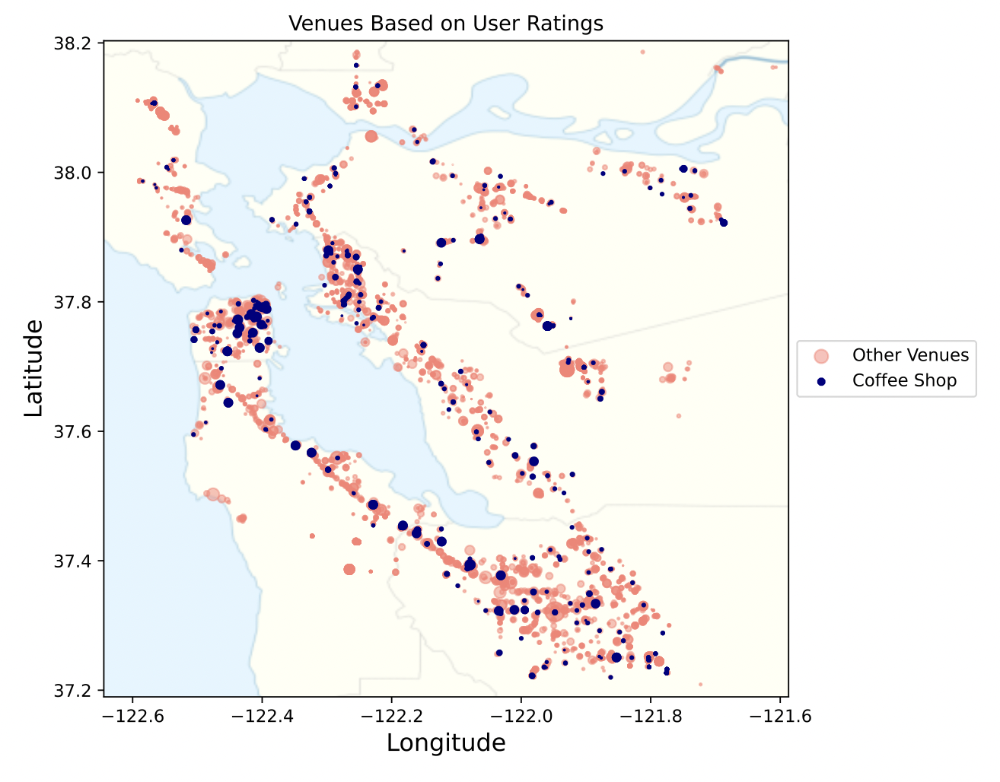
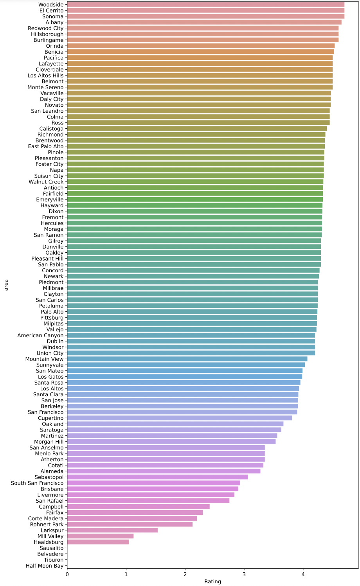

# Capstone Project: Retail Store Locator Recommender - Coffee Shop
#### By: Amanda Khairunnisa - General Assembly (DSIR-Nightingale)

## I. Background + Problem Statement

When opening an offline retail store, one of the most important things of highest capital expense to consider is location. Choosing the right location can be detrimental towards the survival of the business. 

This project aims to explore the use of machine learning in determining where to open a coffee shop in the San Francisco Bay Area.

## II. Summary of Execution

   ### a. Data Collection and Cleaning
   *[Notebook](./code/1.01-data_collection.ipynb)*
   
   In order to model a store-locator recommender, a dataset needs to be generated with the following data points:
   - City/Town-level demographics data: Population, Median Household Income and Income per Capita
   - Recommended venues per city: venues as per Foursquare Places API 
   - Venue category: Category of venues as per Foursquare Places API (i.e. Coffee Shop, Parks, etc).
   - Geographic data: Both at city/town-level and per venue-level
   - User generated data: Rating and reviews per venue based on Google Places API.
   - Nulls are handled accordingly, refer to notebook to see actions taken

   ### b. Exploratory Data Analysis
   *[Notebook](./code/2.01-exploratory_data_analysis.ipynb)*
   
   **Mapping**
   
    
   
   Out of ~14.9K venues collected from 101 cities / towns in 9 counties around the Bay Area, the map on the left shows a summary of the particular areas weighted based on the number of population in said cities / towns and categorized by counties. We can observe that out of all the counties, San Francisco, Santa Clara and Alameda are three of the highest populated counties.
   
   Looking at the map on the right, we can see the venues collected weighted by user ratings based on its location within the Bay Area. We can observe how coffee shops seem to cluster in relatively high populated areas like San Francisco and Alameda, when comparing it to the the map on the left.
   
   **Coffee Shop Analysis**
   
   ***Population per Coffee Shop in Area***
   
   
   
   The chart represents the density of population per number of Coffee Shops in the area. The higher the number, the less number of coffee shops there are per person.
   
   ***Population per Coffee Shop in Area***
   
   
   
   The bar chart above represents the average rating of Coffee Shops per area.
   
   ***Population per Coffee Shop in Area***
   
   
   
   The above graph shows the average price level of coffee shops in the area. We can observe that the highest price level is 2, which means one order can be around USD 10-25 - a relatively steep price for coffee. We can also see that Half Moon Bay, Tiburon, Belverea and Susalito's price levels are 0, this is due to the fact that some venues do not have Google API's atmospheric data.
   
   
   ### c. Feature Engineering
   *[Notebook](./code/3.01-feature_engineering.ipynb)*
   
   Based on the EDA and understanding of the problem statement, we select and engineered the following features that would be used within our model and inference purposes:
   
   **Population and Density Metrics**
   - User Ratings as % of Population: No. of User Ratings here are used as a proxy for traffic in the area and is engineered to become a percent of the population to show penetration
   - Venue and Coffee Shop per Capita: Number of venues and coffee shops divided by the population per area
   
   **Distance Matrix**
   - Venue per Area: Calculating the distance (in meters) between each venue
   - Average Distance per Category per Area: For every venue the minimum distance between said venue to another venue of each category are extrapolated
   
   **Category Frequency per Area**
   - Feature is engineered by dividing the number of venues per category per area by the number of venues per category
   
   
   ### d. Modeling and Evaluation
   *[Notebook](./code/4.01-model_fit.ipynb)*
   
   The decision to use an interpretable classification model was made based on the following simplified logic: by understanding what kind of venues are considered an important feature or have a degree of consanguinity with coffee shops, we can suggest clients to open their businesses near those venues. The best model will then be used to determine the categories of venues that should be looked at and potentially, together with the engineered features that were dropped, we can narrow down the location(s) even more.
   
   
   
   Looking at the metrics summary above, we can conclude that Random Forest Classifier is the best model to use because it is the most accurate, relatively balanced and is able to split the data almost perfectly at 99.7%.
   
   *Note: Due to the imbalanced nature of the data (due to the fact that only 5.6% of total venues collected are Coffee Shop), SMOTE is applied in order to balance out the classes of data for the model to train on.*
   
  
## III. Conclusion: Recommendations and Limitations
*[Notebook](./code/5.01-inference_and_recommendations.ipynb)*

Using the top 5 feature importances of the Random Forest Classification model (Park, Pizza Place, Ice Cream Shop, Mexican Restaurant, and Bakery), we filter the dataset to only look at those particular venues (~10% of total venues collected). For every venue within the selected categories we look at the distance between them and all coffee shops, and if said distance is less than or equal to the minimum distance of coffee shop to the venue, the venue is not recommended (because it means that there is a coffee shop nearby already). 
   
In the end there are 256 potential locations in the Bay Area to open a coffee shop (which can decrease based on the categories filter). For each location a buffer radius of ~2km (mean of distance between each location to a coffee shop) is created as a proxy to show where a client should open a coffee shop in the Bay Area. A visual representation can be seen below:
   

   
**Understanding Limitations**
- Simplification of real life: a model is just a simplification of real life - it is not necessarily the "truth"
- Visualization limitations: Coffee Shops may seem to fall in the radius circle, but that is most probably because of the image scale
- Data limitations: Lack of data on traffic / revenues which may help create a more realistic model is unavailable
   
**Recommendations**
- Decrease the recommended areas even more by looking at the area of overlap between multiple venues
- Using engineered features and existing features to narrow down the location(s) even more
- Gather all venues within the area instead of just recommended venues by Foursquare API
- Collect data on mobility / traffic for each venue and/or closest public transportation to the venue (which may impact traffic)
- Cumulate information of neighborhoods in areas (i.e. Business District, Residential areas, etc.)
- Generate data on commercial properties' prices and client budget to decrease number of recommendations even more
- Try applying model to other venue categories